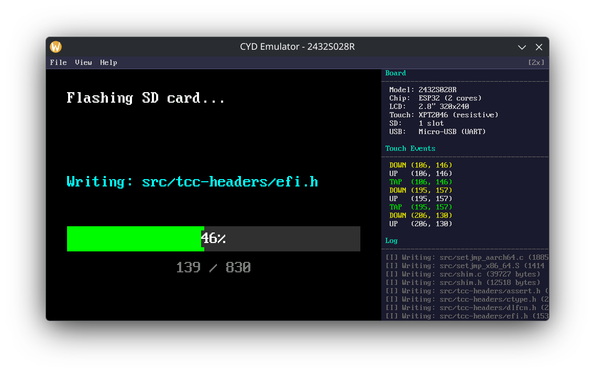

# cyd-emulator



Desktop emulator for ESP32 CYD (Cheap Yellow Display) firmware. Runs your ESP32 app code natively on Linux using SDL2, with an emulated 320x240 ILI9341 display, resistive touchscreen, and SD card.

## Quick start (standalone demo)

No external firmware needed — just clone and build:

```bash
git clone https://github.com/nocomp/cyd-emulator.git
cd cyd-emulator
mkdir build && cd build
cmake ..
make -j$(nproc)
./cyd-emulator
```

This builds and runs the FreeRTOS test suite demo by default (when no external firmware is found).

### Built-in demos

Two demo apps are included:

| Demo | Directory | Description |
|------|-----------|-------------|
| **freertos** | `demos/freertos` | FreeRTOS primitives test suite (tasks, semaphores, queues, event groups, timers) |
| **nolibrary** | `demos/nolibrary` | Interactive drawing pad using bare display/touch APIs |

Select a demo with:

```bash
cmake -DAPP_SOURCE_DIR=demos/nolibrary ..
cmake -DAPP_SOURCE_DIR=demos/freertos ..
```

## What it does

- Compiles your ESP32 firmware's C source files directly (no cross-compilation)
- Renders the ILI9341 display to an SDL2 window at 60 FPS
- Emulates touch input via mouse clicks
- Attaches FAT32 or exFAT SD card images via File menu
- Provides ESP-IDF shim headers so `#include "esp_log.h"` etc. just work
- FreeRTOS primitives: tasks, semaphores, queues, event groups, timers
- Info panel shows chip model, display resolution, touch events, and SD card status
- Supports multiple CYD board profiles (`--board 2432S028R`, `--board 8048S070`, etc.)

## Building with your own firmware

### Dependencies

- SDL2 development libraries
- CMake 3.10+
- The ESP32 firmware source (or use a built-in demo)
- miniz (`libminiz-dev`, only needed when building with external firmware)

### Build

Point at your firmware source directory:

```bash
mkdir build && cd build
cmake -DAPP_SOURCE_DIR=/path/to/your/esp32/main ..
make -j$(nproc)
```

If the emulator is checked out next to the `survival` project (`../survival/esp32/main`), it detects and uses those sources automatically. Otherwise, it falls back to the built-in FreeRTOS demo.

### Run

```bash
./cyd-emulator                             # default board (2432S028R)
./cyd-emulator --board 8048S070            # 800x480 S3 board
./cyd-emulator --sdcard test/sdcard-fat32.img  # pre-attach SD card
```

## Writing your own app

Create a directory with at minimum:

- `main.c` — your firmware entry point (must define `void app_main(void)`)

The emulator provides API headers for display, touch, SD card, and FreeRTOS in the `demos/common/` and `include/` directories. Your `app_main()` runs in a dedicated thread. Call `display_fill_rect()`, `touch_read()`, etc. exactly as you would on real hardware. Use `vTaskDelay()` for timing.

```bash
cmake -DAPP_SOURCE_DIR=/path/to/your/app ..
```

## Architecture

```
src/
  emu_main.c      Main thread: SDL window, event loop, menu bar, info panel
  emu_display.c   Framebuffer: RGB565 pixel ops, shared via mutex
  emu_touch.c     Touch emulation: mouse events -> touch_read() API
  emu_sdcard.c    SD card: attach/detach disk images, block-level I/O
  emu_payload.c   Payload stub: emulates firmware update flash region
  emu_crc32.c     CRC32 shim: wraps miniz crc32
  emu_json.c      Minimal JSON parser for board profile configs
  emu_freertos.c  FreeRTOS emulation: tasks, semaphores, queues, timers

demos/
  common/         Shared API headers (display.h, touch.h, etc.) and font data
  nolibrary/      Drawing pad demo (no FreeRTOS beyond vTaskDelay)
  freertos/       FreeRTOS test suite

include/          ESP-IDF shim headers (esp_log.h, freertos/*.h, etc.)
```

The emulator launches two threads:
1. **Main thread** -- SDL init, window creation, event loop, menu rendering
2. **App thread** -- calls `app_main()` from your firmware, exactly as ESP-IDF would

The display framebuffer and touch state are shared between threads via mutexes.

## How it works with your firmware

Your firmware calls functions like `display_fill_rect()`, `touch_read()`, `sdcard_read_sector()`. On the real ESP32, these talk to SPI peripherals. In the emulator, shim implementations in `src/emu_*.c` redirect them to SDL2 and file I/O. Your app code is compiled verbatim -- no `#ifdef EMULATOR` needed.

## License

MIT
